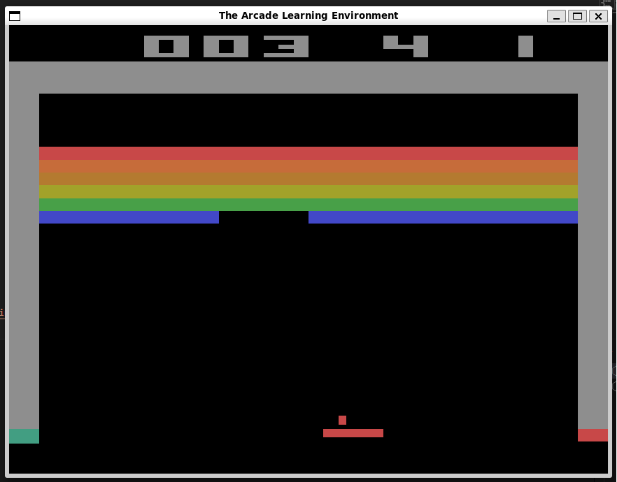

# RL Training with Custom and Atari Environments

## Setup Instructions

1. Create a virtual environment:

2. Install dependencies:

3. Run training on Atari games (e.g., Breakout):

4. To train on your custom asteroid game:
Change the `environment_name` variable in `train_atari.py` to `"asteroid"`.

# Start trainning using Breakout-v4 with rendering -  Slower Training, but fun to watch... `;)`
`python3 train.py --env Breakout-v4 --timesteps 5000 --render`

# Train using Breakout-v4 without rendering - Faster Training
`python3 train.py --env Breakout-v4 --timesteps 500000`

## Installing Dependencies:

# In shell or bash
pip install gymnasium[atari] stable-baselines3[extra]

# In zsh, square brackets [] are used for pattern matching (globbing).
pip install gymnasium\[atari\] stable-baselines3\[extra\]

# Using single or double quotes will also work.
pip install "gymnasium[atari]" "stable-baselines3==2.3.2"

# Key Metrics in the Log:
- ep_len_mean (Episode Length Mean): The average length of the episodes during training. In this case, it started around 275 steps per episode.
- ep_rew_mean (Episode Reward Mean): The average reward achieved per episode. Initially, it’s around 1.86 but fluctuates slightly as training progresses.
- fps (Frames per Second): The number of frames the model processes per second. Currently, it's around 115-148 FPS.
- total_timesteps: The cumulative number of timesteps processed so far. For each update cycle, the model processes 2048 timesteps (as indicated in PPO’s default setup).
- learning_rate: The learning rate used by the PPO model, which is currently 0.0003.
- value_loss, policy_gradient_loss, entropy_loss: These values give insight into the model's optimization process:
- value_loss: The error in the value function estimation.
- policy_gradient_loss: The loss in the policy update process.
- entropy_loss: Measures the randomness of the policy (higher entropy means more exploration).

----------------------------------------
| rollout/                |            |
|    ep_len_mean          | 347        |
|    ep_rew_mean          | 3.58       |
| time/                   |            |
|    fps                  | 95         |
|    iterations           | 30         |
|    time_elapsed         | 640        |
|    total_timesteps      | 61440      |
| train/                  |            |
|    approx_kl            | 0.5741701  |
|    clip_fraction        | 0.574      |
|    clip_range           | 0.2        |
|    entropy_loss         | -0.59      |
|    explained_variance   | 0.54615164 |
|    learning_rate        | 0.0003     |
|    loss                 | -0.108     |
|    n_updates            | 290        |
|    policy_gradient_loss | -0.094     |
|    value_loss           | 0.0149     |
----------------------------------------

# Repo information:

`git remote add origin https://github.com/do360now/RL_Training.git`

# List of games:
- Breakout-v4: Classic brick-breaking game.
- Pong-v4: Classic table tennis game.
- SpaceInvaders-v4: Defend against waves of aliens.
- MsPacman-v4: Navigate through mazes while collecting pellets. # Not working
- Asteroids-v4: Destroy incoming asteroids.
- Qbert-v4: Jump on cubes to change their color.
- Seaquest-v4: Control a submarine to rescue divers and shoot enemies.
- Enduro-v4: A racing game where you must overtake other cars.

## Options:
- `model = PPO("CnnPolicy", env, verbose=1, learning_rate=3e-4)`  # Try lower rates like 1e-4
- `model = PPO("CnnPolicy", env, verbose=1, n_steps=4096)`  # Try increasing the steps
- `model = PPO("CnnPolicy", env, verbose=1, gamma=0.99)`  # Experiment with values like 0.98 or 0.995
- `model = PPO("CnnPolicy", env, verbose=1, ent_coef=0.01)`  # Try increasing it (e.g., 0.02)
- `model = PPO("CnnPolicy", env, verbose=1, buffer_size=1000000)`  # Try increasing the buffer

learning_rate: The learning rate used for updating the policy network.
Default: 3e-4 (or 0.0003)

n_steps: Number of steps to run for each environment per update.
Default: 2048.

batch_size: Minibatch size for each gradient update.
Default: 64.

n_epochs: Number of epochs to train for each update.
Default: 10.

gamma: Discount factor for rewards (for future rewards).
Default: 0.99.

gae_lambda: Factor for trade-off of bias vs variance for Generalized Advantage Estimator (GAE).
Default: 0.95.

clip_range: Clipping parameter for PPO.
Default: 0.2.

ent_coef: Entropy coefficient to encourage exploration.
Default: 0.0.

vf_coef: Coefficient for the value function loss.
Default: 0.5.

max_grad_norm: Maximum norm for the gradient clipping.
Default: 0.5.

# Model training stats, latest on top:

# Breakout-v4:
---------------------------------
| rollout/           |          |
|    ep_len_mean     | 460      |
|    ep_rew_mean     | 5.94     |
| time/              |          |
|    fps             | 138      |
|    iterations      | 1        |
|    time_elapsed    | 14       |
|    total_timesteps | 264192   |

Model saved as ppo_Breakout-v4.zip
